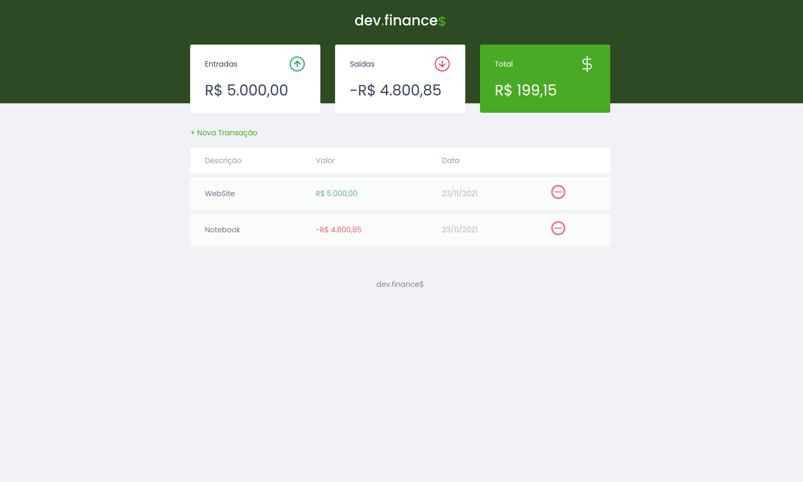

# Maratona Discover

Esse é o projeto criado acompanhando as aulas da Maratona Discover da [Rocketseat](https://www.rocketseat.com.br/)

## Índice

- [Visão Geral](#Visão-Geral)
  - [O Desafio](#the-challenge)
  - [Screenshot](#screenshot)
  - [Links](#links)
- [Meu Processo](#Meu-Processo)
  - [Feito com](#Feito-com)
  - [O que aprendi](#O-que-aprendi)
- [Autor](#autor)

## Visão Geral

### O Desafio

Criar uma aplicação utilizando diversas técnicas aprendidas nas aulas do curso Discover da Rocketseat, acompanhando as explicações e passo a passo com os vídeos da maratona.

### Screenshot

### Links

- Solution URL: [GitHub](https://github.com/gabrielpedutti/maratona-discover)
- Live Site URL: [Live Site](https://gabrielpedutti.github.io/maratona-discover)

## Meu Processo

### Feito com

- Semantic HTML5 markup
- CSS custom properties
- Flexbox
- JavaScript
- DOM
- Mobile-first workflow

### O que aprendi

Coloquei em prática tudo o que aprendi durante as vídeo aulas disponibilizadas pela Rocketseat, envolvendo HTML, CSS, Flexbox, DOM, JavaScript, entre outras coisas.
Além disso revisei e aprendi alguns detalhes que ainda não havia entendido com clareza apenas com as aulas.

## Autor

- Perfil Rocketseat - [@gabrielpedutti](https://app.rocketseat.com.br/me/gabriel-pedutti-03660)
- Linkedin - [Gabriel Pedutti](https://www.linkedin.com/in/gabriel-pedutti-9698b520b/)
- Twitter - [@gabrielpedutti](https://www.twitter.com/gabrielpedutti)

